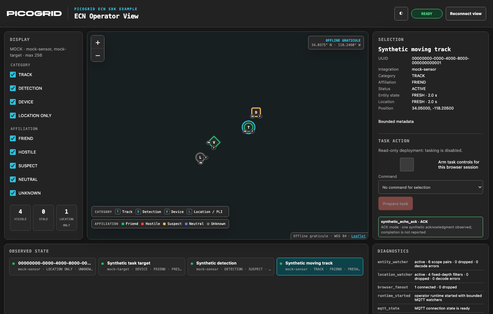
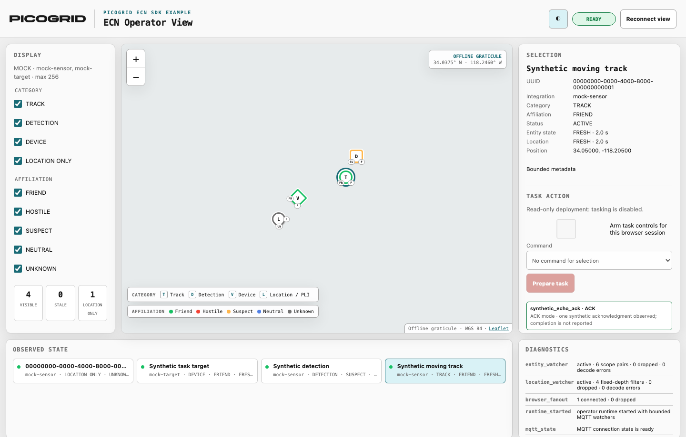
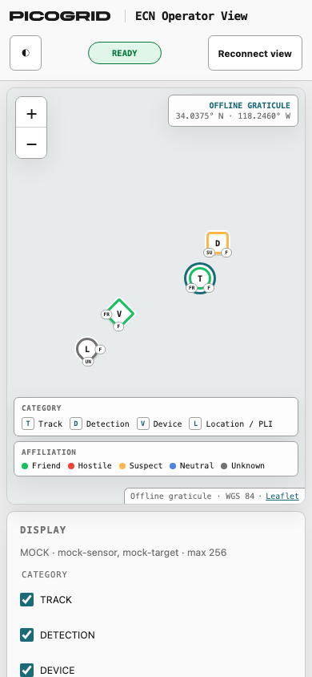
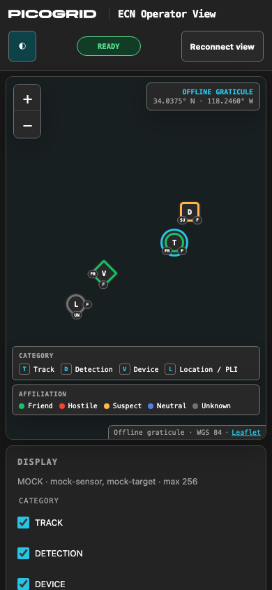

Use this walkthrough to build a live map from authorized tracks and location updates,
then operate the included operator application. The map keeps its view narrow and
makes connection and freshness states visible.

For a map that needs tracks and their location updates:

1. Open a TRACK entity stream for the exact authorized integration.
2. Learn the bounded set of entity IDs relevant to the current view.
3. Open location watchers only for those IDs and the same integration.
4. Use latest-value delivery, age each observation, and mark stale data clearly.
5. Close watchers when entities leave the view.
6. Never replace this with an all-category, all-integration capture subscription.

```python
from uuid import UUID

from picogrid_ecn_client import DeliveryPolicy, ECNClient


async def observe_visible_locations(client: ECNClient) -> None:
    visible = {
        UUID("00000000-0000-4000-8000-000000000001"),
        UUID("00000000-0000-4000-8000-000000000002"),
    }
    stream = await client.locations.watch(
        entity_ids=visible,
        integrations={"authorized-source"},
        buffer_size=32,
        delivery=DeliveryPolicy.LATEST,
    )
    try:
        async for event in stream:
            print(event.entity_id, event.location.latitude, event.location.longitude)
    finally:
        await stream.aclose()
```

Use the runnable [track watcher](../../examples/watch_tracks.py) and
[location observer](../../examples/get_ecn_location.py) as small building blocks.
Observed state is ephemeral and should not be presented as authoritative history.

For a complete runnable view, use the included
[operator application](../operator/application.md). Its separate wheel contains the
compiled browser application and runs on the installed public client wheel. It
correlates entity and location events by canonical UUID, displays bounded connection
and stream diagnostics, and closes its watchers and MQTT client deterministically.
Read-only mock mode is the default. Enabling tasking in either mode requires explicit
integration, command, and exact target-UUID allowlists, the tasking flag, typed payload
validation, and per-publication operator confirmation; there is no command discovery,
automatic tasking, or retry that could duplicate an effect.

## Sanitized offline gallery

These views are generated from the loopback mock with deterministic synthetic data.
They are offline UI evidence only and contain no live entity, endpoint, credential,
remote tile, or staging observation.

| Viewport and theme | Screenshot |
|---|---|
| Desktop, dark |  |
| Desktop, light |  |
| Mobile, light |  |
| Mobile, dark |  |

## Operator walkthrough

### Start and verify

1. Follow the operator application's
   [installation instructions](../getting-started/installation.md#install-the-operator-application)
   to install the matching client and operator wheels, then run
   `picogrid-ecn operator --demo`. No source copy, Node.js installation, npm command,
   or second development server is part of this runtime path.
2. Open the loopback browser URL. Verify that the connection indicator is **ready**,
   the configured integrations appear under **Display**, and the diagnostic counts
   match the requested entity and location filters. The shipped operator application
   labels a lost browser view **view disconnected** or **reconnect required**; MQTT
   diagnostics report the client as **reconnecting** when applicable.

### Observe the current picture

3. Filter by category or affiliation, select a marker, and inspect its canonical UUID,
   integration, public metadata, independently aged entity state, and latest
   MQTT-observed location. The shipped operator application labels observations
   **FRESH** or **STALE**. A location-only marker intentionally has no invented
   entity metadata.

### Enable and prepare tasking

4. Leave tasking **disabled** for ordinary observation. Before preparing a task, obtain
   written authorization for the exact ECN target, target UUID, and command;
   confirmation is not authorization. When an authorized workflow requires tasking,
   restart with the explicit tasking flag, closed command policy, integration
   allowlist, and exact target-UUID allowlist.
5. Select only an authorized fresh entity, arm the current browser session, choose an
   allowlisted command, enter a schema-valid bounded payload, and select **Prepare
   task**. The prepared task is **awaiting confirmation** and has not been sent.
6. Review the complete target, command, response mode, and payload in the confirmation
   dialog. Fresh observations for the same integration/UUID may continue without
   changing the selected identity; selection, staleness, policy, readiness, and expiry
   are rechecked before confirmation.

### Confirm and send once

7. Check the confirmation box and select **Confirm and send once**.
   This action sends the task. The application publishes once with no automatic retry.
8. Interpret the shipped operator application's outcome literally. It shows ACK, the
   returned final task status, **FAILED**, **TIMEOUT**, **CANCELLED**, **RECONNECT**,
   **OUTCOME_UNKNOWN**, or **UNKNOWN**; it does not expose separate **sent** or
   **authorization denied** status labels.
   Acknowledgment mode emits exactly one ACK and no unsolicited completion response.
   When building an operator display, label a policy or broker denial **authorization
   denied**, label an unsuccessful request **failed**, and reserve **sent** for a
   completed publication rather than downstream execution. If the downstream result
   is inconclusive, report **outcome unknown**, never success. The shipped application
   retains the task ID when available and the delivery phase in that outcome so an
   operator can correlate downstream state before considering another action.

### Recover or close

1. If the browser or MQTT connection is lost, the application discards prepared work,
   disarms tasking, marks observations stale or disconnected, and requires an explicit
   browser reconnect plus a new preparation step. A manual reconnect opens a
   replacement state WebSocket only after the local backend acknowledges retirement
   of the exact prior browser-view generation; that lifecycle request does not contact
   the ECN.
2. Close the browser and application, then remove the external work directory.
    Confirm that the process exits cleanly and that no watcher, task response
    subscription, MQTT connection, mock broker client, or temporary credential mount
    remains.

## Production use checklist

### Deployment and access

- Use matching, inspected client and operator wheels from the same release.
- Keep verified TLS and caller-owned mTLS material outside source, images, build
  contexts, logs, and reports; never enable remote plaintext or TLS bypass.
- Confirm broker ACLs independently. Operator application controls do not prove
  server-granted authorization; design the operator display to show a denied operation
  as **authorization denied**.
- Keep the local application server bound to loopback; use the separate explicit
  container-bind guard only inside the hardened container recipe.
- Treat the browser API as a trusted, local, single-user control surface. It is not an
  ECN API. It has no user login or per-user authorization, and Host, Origin,
  intent-header, and loopback controls do not authenticate another process on the
  same host.

### Observation and tasking

- Review the integration and category allowlists before observing.
- Before enabling tasking, review the integration, command, and exact target-UUID
  allowlists and confirm that the task payload passes validation.
- Require a complete operator review and one final human confirmation for every task.
  Make the send action unmistakable, publish once, and never retry automatically.
- Retain deployment-appropriate operator audit records without logging secrets.

### Operational state and release validation

- Design the operator display so **disconnected**, **reconnecting**, **stale**,
  **tasking disabled**, **authorization denied**, **data dropped**, **failed**, and
  **outcome unknown** are visually distinct from success.
- Monitor bounded connection, watcher, decode-error, dropped-event, browser-fanout,
  task-outcome, freshness, and cleanup diagnostics.
- Run offline mock validation and separately authorized staging validation as
  different evidence tiers. Review [Compatibility and limitations](../compatibility/limitations.md)
  before operational deployment.

The installed application has offline browser and cleanup coverage. This walkthrough
does not claim that the operator application has been validated against staging or
production.
